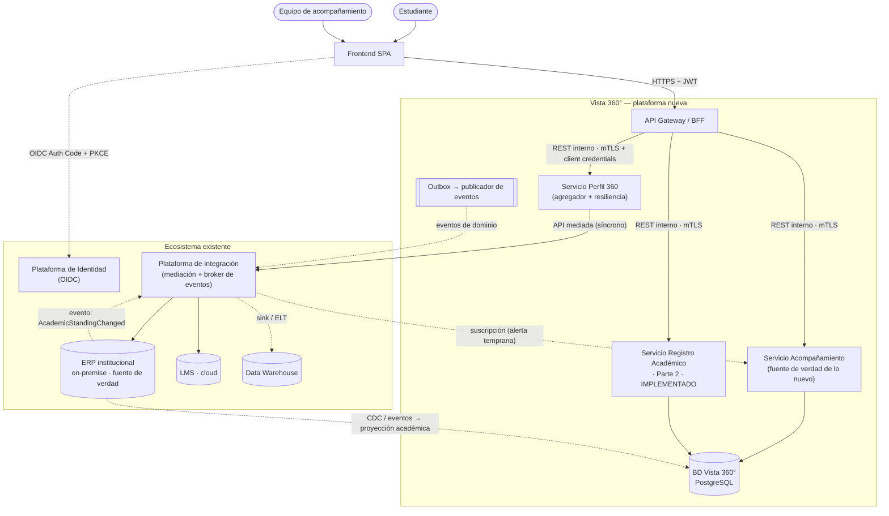
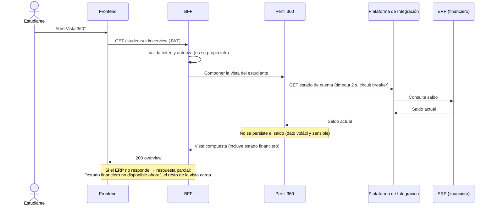
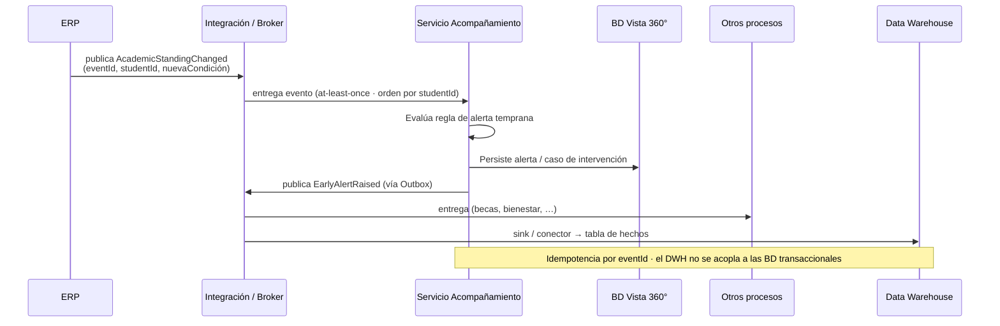

# Vista 360° — Arquitectura de la solución (Parte 1)

Documento breve con el diagrama de arquitectura, las decisiones más importantes y los
supuestos declarados. El análisis completo del caso está en
[`00-analisis-y-propuesta.md`](00-analisis-y-propuesta.md).

---

## 1. Alcance y principio rector

Vista 360° es una **capa propia** sobre el ecosistema existente. No reemplaza sistemas:
lee datos de los sistemas fuente y **añade** la información y la funcionalidad de
acompañamiento, que hoy no existe en ningún lado.

**Principio rector: la vista se compone en el backend, no en el frontend.** Un
*Backend for Frontend* (BFF) orquesta y agrega; el frontend nunca habla con el ERP ni con
el LMS.

---

## 2. Diagrama de arquitectura

**Leyenda:** línea **sólida** = comunicación **síncrona** (petición/respuesta);
línea **punteada** = comunicación **asíncrona** (eventos / CDC).

---

## 3. Para cada dato: de dónde sale y por qué

| Dato | Fuente de verdad | Cómo lo obtiene Vista 360° | Por qué así |
|---|---|---|---|
| Identidad / inicio de sesión | Plataforma de Identidad | OIDC (Authorization Code + PKCE) | Es la fuente y usa estándares abiertos; no se replican credenciales. |
| Datos personales | ERP | API mediada por la Plataforma de Integración, *on-demand* + cache corta | Fuente de verdad; cambian poco; toleran cache. |
| Datos académicos oficiales (matrícula, notas, condición) | ERP | API *on-demand* **+ proyección local** alimentada por eventos/CDC | Lectura frecuente; la proyección desacopla y habilita analítica y el servicio de la Parte 2. |
| **Estado financiero / estado de cuenta** | ERP | **API síncrona *on-demand*, sin persistir** (cache de segundos como mucho) | Dato **volátil y sensible**; el usuario necesita el valor exacto "ahora" (Escenario 3.2.A). |
| Actividad en el campus virtual | LMS (cloud) | API del LMS mediada; cache con TTL medio | Sistema externo; tolera algo de latencia de frescura. |
| Reportes / alertas / solicitudes de acompañamiento | **Vista 360° (propio)** | BD propia | No existen hoy en ningún sistema; son nuevos. |
| Asignación asesor ↔ estudiante | **Vista 360° (propio)**, semilla desde RRHH/ERP | BD propia | Es la base de la autorización del equipo de acompañamiento. |
| Alimentación del Data Warehouse | Todos los sistemas | **Eventos de dominio + CDC → tópicos → sink al DWH (ELT)** | Desacopla; el DWH no consulta las bases transaccionales ni al revés. |

---

## 4. Cómo se comunican los componentes

| Enlace | Estilo | Mecanismo y seguridad |
|---|---|---|
| Frontend → BFF | Síncrono | REST/HTTPS + JWT de OIDC (token de usuario). |
| BFF → servicios de dominio | Síncrono | REST interno (o gRPC), **mTLS** + token de servicio (OAuth2 *client credentials*), red privada. |
| Vista 360° → ERP / LMS (lecturas puntuales) | Síncrono | API mediada por la Plataforma de Integración. Timeout + *circuit breaker* + degradación parcial. |
| ERP → Vista 360° (cambios relevantes) | Asíncrono | Evento publicado en el broker; Vista 360° se suscribe. |
| Vista 360° → otros procesos / DWH | Asíncrono | **Transactional Outbox** → broker → consumidores + *sink* al DWH. Entrega *at-least-once*, eventos idempotentes por `eventId`, partición por `studentId`. |

### 4.1 Escenario 3.2.A — el estudiante necesita ver su estado financiero de inmediato

**Fundamento:** es un dato *read-your-own*, de baja cardinalidad por petición, que exige
**exactitud sobre frescura de cache**. Un *pull* síncrono contra la fuente es lo correcto;
no se justifica una arquitectura de eventos para un dato que se lee de forma puntual. La
resiliencia (timeout corto, *circuit breaker*, degradación parcial) evita que una demora
del ERP tumbe toda la Vista 360°.

### 4.2 Escenario 3.2.B — cambia la condición académica de un estudiante

**Fundamento:** hay **varios consumidores desacoplados** (acompañamiento, otros procesos,
DWH) y la plataforma debe **reaccionar temprano**. Un evento de dominio publicado una vez y
consumido por quien lo necesite es lo correcto. El **Outbox** garantiza que el evento no se
pierda aunque el broker esté caído; la **idempotencia** y el **orden por `studentId`**
hacen segura la entrega *at-least-once*. El DWH se alimenta por el mismo flujo de eventos
(ELT), nunca consultando las bases transaccionales.

---

## 5. Decisiones más importantes

| Decisión | Fundamento |
|---|---|
| **BFF que agrega en el backend** | Una sola llamada del frontend; la lógica de composición, resiliencia y autorización vive en un lugar; el frontend no conoce el ecosistema. |
| **Servicio de Acompañamiento como fuente de verdad de lo nuevo, con BD propia (PostgreSQL)** | Es la única información que Vista 360° posee; el resto lo lee de los sistemas fuente (supuesto S4). |
| **Proyección académica local alimentada por eventos/CDC** | Desacopla a Vista 360° de la disponibilidad del ERP para lecturas frecuentes y habilita el DWH. El servicio de la Parte 2 se construye sobre esta proyección. |
| **Estado financiero siempre en vivo desde el ERP, sin persistir** | Dato volátil y sensible; la exactitud manda. |
| **Síncrono para "leer ahora", asíncrono para "propagar cambios"** | Cada estilo donde corresponde; ni todo REST ni todo eventos. |
| **Transactional Outbox para publicar eventos** | Publicación confiable sin *dual write* entre la BD y el broker. |
| **DWH alimentado por eventos/CDC, no por consultas** | El almacén analítico no se acopla a las bases transaccionales. |
| **Identidad delegada a la plataforma OIDC** | Estándar abierto; Vista 360° es *resource server*, no IdP. |
| **Autorización a nivel de recurso** (estudiante dueño / asesor asignado) evaluada en el backend con el token | El frontend no es de fiar; la relación asesor↔estudiante se verifica contra datos propios. |

---

## 6. Supuestos declarados

Resumen (detalle y justificación en [`00-analisis-y-propuesta.md`](00-analisis-y-propuesta.md#2-supuestos-declarados)):

| # | Supuesto |
|---|---|
| S1 | La Plataforma de Integración expone las APIs mediadas del ERP y del LMS y ofrece un broker de eventos/mensajería. |
| S2 | El ERP puede emitir eventos o se le puede aplicar CDC; si no, hay *fallback* de *polling*/batch. |
| S3 | La Plataforma de Identidad soporta OIDC (Auth Code + PKCE) para usuarios y *client credentials* para servicios. |
| S4 | Vista 360° es **solo lectura** sobre ERP y LMS; solo es fuente de verdad de la información de acompañamiento. |
| S5 | La asignación asesor↔estudiante nace en RRHH/ERP y se sincroniza; mientras tanto se administra en Vista 360°. |
| S6 | Para la Parte 2, el servicio usa su propia BD con datos de ejemplo, que representa la proyección alimentada del ERP. |
| S7 | Volúmenes moderados (decenas de miles de estudiantes) → PostgreSQL es suficiente. |
| S8 | El frontend es una SPA web (posible app móvil a futuro). |
| S9 | Los datos académicos y financieros oficiales se leen del ERP; Vista 360° no los recalcula. |
